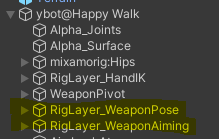

# PlayerAimingAnimation
prereq: Make sure you have the animation rigging package installed (you need to enable preview packages to see it)

First, I created a  player object (ybot@happywalk) that serves as a container for the player mesh/animations, the weapon transform, and two rig layer poses (one for running around with the gun down, and one for aiming the gun).



Each of the Riglayer pose objects have a "Rig" component with a single "weight" value. By changing the value of weight from a script, I can transition smoothly between different poses. 

[Pose weights video](./poseweight.mp4)

But what are "poses". They are basically just transforms that you can constrain other objects to. For my regular weapon pose I am constraining the gun transform (called WeaponPivot) to the weapon pose object. And the weapon pose object is being constrained to the characters shoulder, so that its position moves with the animation of the shoulder. 


To get the position of the pose right I go into play mode, make adjustments to the transform, copy the component values, stop play mode, and paste the values back in. 

The aim pose looks like this 


This pose has an aim constraint which forces the pose to face the aimTarget, which, in my case is a crosshair object that is the child of the camera and is offset on the z axis to be in front of the camera. 

And the code to switch between poses is as follows: 

```csharp
  private void Animate()
    {
        if (isAiming)
        {
            if (aimPose.weight < 1)
            {
                aimPose.weight = Mathf.Lerp(aimPose.weight, 1, Time.deltaTime * poseTransitionSpeed);
            }

        }
        else if (aimPose.weight > 0)
            {
                aimPose.weight = Mathf.Lerp(aimPose.weight, 0, Time.deltaTime * poseTransitionSpeed);
            }
        }
      }
```
